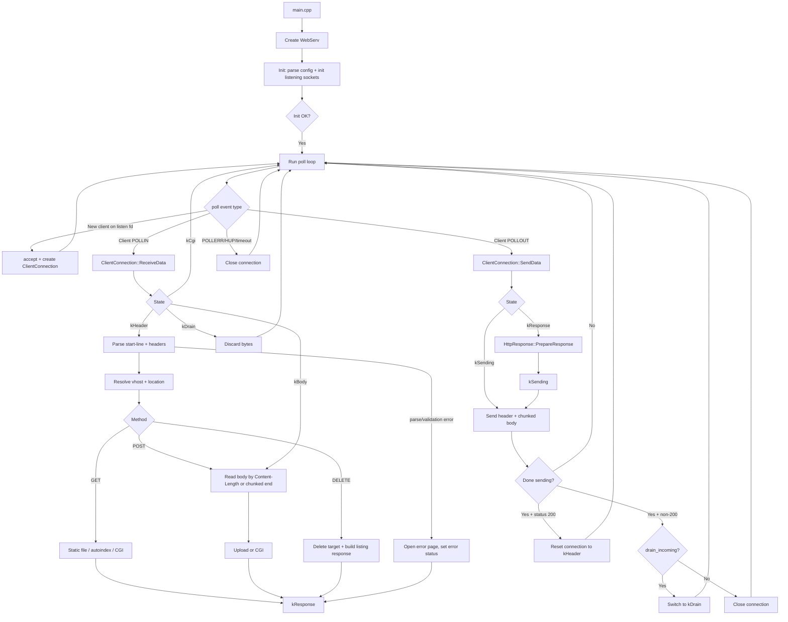

# WebServ Workflow

## Overview
This project is a single-process, event-driven HTTP/1.1 server built around `poll()`.  
Core runtime flow:

1. Parse config and initialize listening sockets.
2. Enter `poll()` loop.
3. Accept clients and dispatch I/O through connection objects.
4. Parse request, resolve virtual host + location, execute method logic.
5. Stream HTTP response (static file, generated content, or CGI output).
6. Reset keep-alive connection or close on error/timeout.

## Mermaid Schema (Overall Flow)

---

## 1) Startup

Entry point is `srcs/main.cpp`:

1. Validate args: `./webserv [configuration_file]`.
2. Construct `WebServ`.
3. Call `WebServ::Init()`.
4. If init succeeds, call `WebServ::Run()`.

If no config path is provided, default is `conf/default.conf`.

---

## 2) Configuration Parsing

`ConfigParser` (`srcs/Webserv/ConfigParser.cpp`) does:

1. Open config file.
2. Strip comments (`# ...`) and load into a stream.
3. Parse `server { ... }` blocks.
4. Parse directives:
   - `listen ip:port;`
   - `server_name ...;`
   - `client_max_body_size ...;`
   - `error_page code path;`
   - `location /path { ... }`
5. Parse location directives:
   - `limit_except ...`
   - `return ...`
   - `root ...`
   - `autoindex on|off;`
   - `index ...;`
   - `upload ...;`

If multiple `server` blocks share the same `listen`, they are merged into one `Socket` with multiple `VirtualHost` entries.

---

## 3) Socket Initialization

`Socket::InitServer()` (`srcs/Webserv/Socket.cpp`) does:

1. `getaddrinfo(address, port)`.
2. `socket()`.
3. `setsockopt(SO_REUSEADDR)`.
4. `bind()`.
5. `listen()`.
6. Push listening `pollfd` into server poll list.

Each successful listening socket is tracked at the beginning of `pollFDs_`.

---

## 4) Event Loop

`WebServ::Run()` + `WebServ::PollAvailableFDs()` (`srcs/Webserv/WebServ.cpp`) are the core loop:

1. Call `poll(pollFDs_, TIMEOUT)`.
2. For each ready fd:
   - If index is a listening socket: accept new client.
   - Else: dispatch to corresponding `Connection` object.
3. Close on:
   - poll errors (`POLLERR`)
   - read/write failure
   - timeout
4. On SIGINT, stop loop and clean up all FDs.

Connection cap is 500 active client/aux connections.

---

## 5) Connection Types

Base class: `Connection` (`includes/Connection.hpp`, `srcs/Webserv/Connection.cpp`)

- Virtual interface:
  - `ReceiveData(pollfd&)`
  - `SendData(pollfd&)`
- Tracks:
  - `fd_`
  - `last_active_`
  - timeout
  - per-response `additional_headers_`

Concrete types:

1. `ClientConnection` for browser/client sockets.
2. `CgiConnection` for CGI child pipe I/O.

---

## 6) ClientConnection State Machine

`ClientConnection` (`includes/ClientConnection.hpp`, `srcs/Webserv/ClientConnection.cpp`) uses:

- `kHeader`
- `kBody`
- `kCgi`
- `kResponse`
- `kSending`
- `kDrain`

Flow:

1. `kHeader`:
   - `recv()`
   - parse request line + headers
   - choose virtual host from `Host` header
   - run request handler
2. `kBody`:
   - continue reading POST body chunks
3. `kCgi`:
   - request is delegated to CGI connection
4. `kResponse`:
   - prepare response headers/body strategy
5. `kSending`:
   - stream response
   - if successful and status is `200`, reset to `kHeader` for next request
   - otherwise close connection
6. `kDrain`:
   - after selected error responses (for example `413`), stop writing and drain incoming request bytes
   - close when client finishes or drain limit is reached

---

## 7) HTTP Parsing and Routing

`HttpParser` (`srcs/Webserv/HttpParser.cpp`) handles:

1. Start line validation:
   - methods: `GET`, `POST`, `DELETE`
   - target must start with `/`
   - version must be `HTTP/1.1`
2. Header parsing:
   - requires `Host`
   - malformed headers -> `400`
   - oversized/incomplete header block -> `431`
3. POST checks:
   - requires `Content-Type`
   - requires `Content-Length` unless `transfer-encoding: chunked`
4. Location resolution:
   - longest matching location prefix
   - rewrite filesystem path as `location.root + path_suffix`
5. Method dispatch:
   - `GET` -> static file, autoindex directory listing, or CGI
   - `POST` -> upload handling or CGI (for `.cgi/.py/.php`)
   - `DELETE` -> remove file and return updated listing page
6. Redirection:
   - if `return` exists in location, set 3xx + `Location` header and skip body.

Also includes simple cookie/session behavior (`session_id` creation + `Set-Cookie`).

---

## 8) Static/Dynamic Content Paths

### GET

1. If autoindex enabled and no index file for directory target:
   - generate temporary HTML directory listing.
2. Else validate path:
   - file or directory (+append index if directory).
3. If target extension is CGI-like (`.cgi`, `.py`, `.php`):
   - spawn CGI flow.
4. Otherwise open file for response streaming.

### POST

1. Validate max body size against virtual host limit.
2. If chunked, unchunk before processing.
3. If CGI target extension:
   - pass request body to CGI stdin.
4. Else:
   - multipart/form-data parser writes uploaded files
   - non-multipart writes payload to upload dir with inferred extension
5. Build HTML response with injected upload list.

### DELETE

1. Resolve target under upload directory.
2. Remove file if exists.
3. Return updated listing HTML.

---

## 9) CGI Workflow

`CgiConnection` (`srcs/Webserv/CgiConnection.cpp`) lifecycle:

1. Create two pipes:
   - parent -> child stdin
   - child stdout -> parent
2. Fork:
   - child:
     - `dup2()` pipes to stdin/stdout
     - `chdir("cgi-bin")`
     - `execve()` interpreter/script
   - parent:
     - creates `CgiConnection` object
     - first writes request body to child stdin
     - then switches to reading child stdout
3. Parse CGI response headers:
   - require valid `Content-Type`
   - optional `Status` must be known
   - invalid CGI output -> `502`
4. On completion/destruction:
   - merge CGI headers into client response on success
   - map failures/timeouts to `500`/`504`/`502`
   - fallback to configured error page

---

## 10) HTTP Response Building/Sending

`HttpResponse` (`srcs/Webserv/HttpResponse.cpp`) does:

1. Determine status line from status code or CGI `Status` header.
2. Set/derive `Content-Type`.
3. Add server header.
4. If no `Content-Length`, use chunked transfer encoding.
5. Send in phases:
   - remaining buffered bytes
   - response headers
   - body chunks (`hex-size\r\nchunk\r\n`)
   - terminal chunk `0\r\n\r\n`

Error behavior:

- For 4xx/5xx, it serves error-page files from `VirtualHost`.
- If error-page file cannot be opened, it emits a minimal inline 500 body.

---

## 11) Virtual Host Resolution

`Socket::FindVhost(host)`:

1. If Host header matches configured virtual host name, use it.
2. Otherwise fallback to first virtual host attached to that listening socket.

Important: `server_name` is HTTP-layer routing only. DNS/hosts resolution is external.

---

## 12) High-Level Lifecycle Example

1. Browser connects to `127.0.0.1:8080`.
2. `accept()` creates a `ClientConnection`.
3. Request line/headers parsed.
4. `Host` selects virtual host.
5. Path matches a location and rewrites to filesystem path.
6. Method handler opens file, performs upload/delete, or starts CGI.
7. `HttpResponse` sends status + headers + body.
8. If success, connection resets for next request; otherwise it closes.
